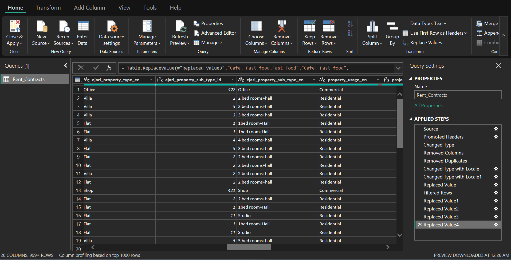
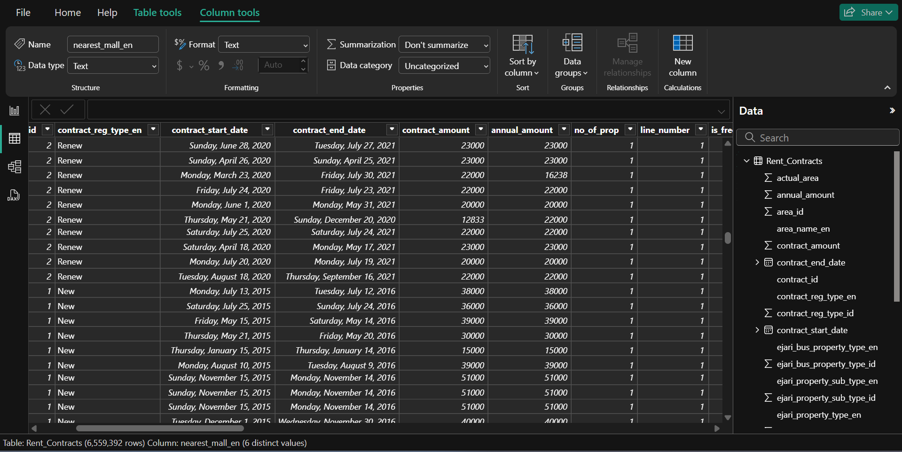
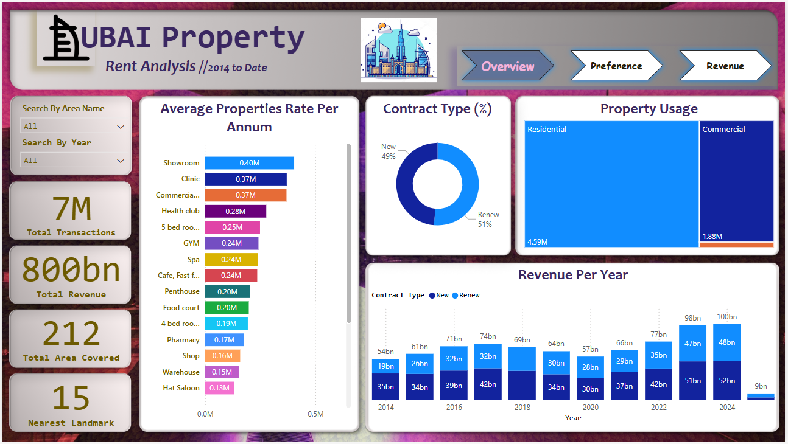
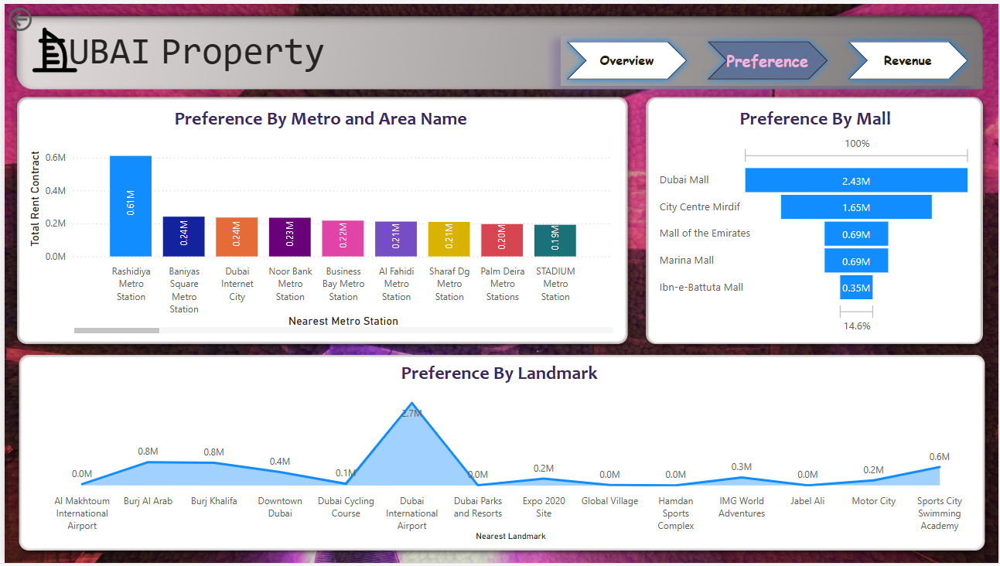
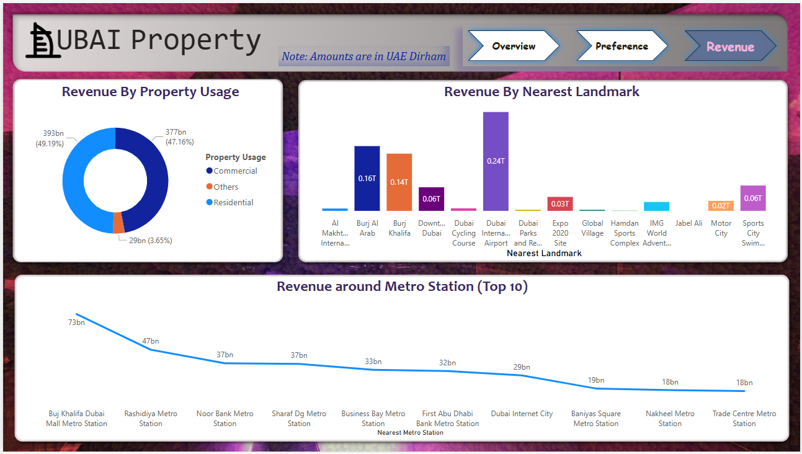

# Dubai Property Rent Analysis
  

## Project Overview
_This is a Power BI project on analysing_ **Dubai’s property** _rental market to identify key trends, revenue distribution, and tenant preferences, enabling investors, stakeholders, and tenants to make data-driven decisions regarding rental transactions, property usage, and high-revenue locations._

This research evaluates rental trends in Dubai from 2014 to date, highlighting contract types, property preferences, revenue streams, and key geographical locations that influence the rental markets. The insights will assist in optimizing investments, understanding tenant behaviour, and identifying lucrative areas for real estate development. 

## Problem Statement

This question encompasses multiple sub-questions:  
1.	What are the trends in rental transactions and revenue over time?  
2.	How do contract types (new vs. Renewals) impact the market?  
3.	What are the most popular property types and their annual rental rates?  
4.	How does property usage (residential vs. Commercial) influence the market?  
5.	What are the most lucrative locations for rentals based on metro stations, malls, and landmarks?

## Skills/ Concepts Demonstrated

The following Power BI features were incorporated and Figma was used to wireframe the dashboard:
-	Bookmarking
-	DAX,
-	Quick measure,
-	Page Navigation,
-	Modelling,
-	Filter,
-	Drilldown
-	Merge Column
-	Replace Value
-	Button
-	Figma

## Methodology

### Data Collection

The dataset used was source from [Ejari System](https://www.dubaipulse.gov.ae/data/dld-registration/dld_rent_contracts-open) which is a Dubai government website for managing rental transaction. Over 6 million row and 28 column of rents contract data from 2014 onwards were used for this project.

### Data Cleaning & Transformation  

-	Standardization of date and rent values, area names, and contract types.
-	Populating of metro station, nearest landmark and mall using the area name for missing value.  
-	Removal of inconsistencies and duplicates.  
-	Aggregation of data by year, location, and property type.

Cleaning                        |        Transformation
:------------------------------:|:----------------------------------:
                  |  

## Visualization & Analysis

The report comprises 3 pages:
1.	Overview
2.	Preferences
3.	Revenue

---
### Overview

#### Total Transactions & Revenue:
-	Approximately 7M total transactions have been recorded to date.
-	The total revenue generated is 800bn AED, highlighting Dubai’s thriving rental market.
-	Annual revenue trends show a steady increase since 2021, peaking at 100bn AED in 2024. 
-	Contract Types:
-	51% of contracts are renewals, indicating tenant retention and stable long-term leasing.
-	49% are new contracts, showcasing market expansion and increased interest in Dubai’s rental sector.

#### Popular Property Types & Rental Rates:
-	Showroom (0.40M AED)
-	Clinic (0.37M AED)
-	Commercial spaces (0.37M AED)
-	Residential property rates:
-	5 bedroom apartments (0.25M AED)
-	4 bedroom apartments (0.19M AED)
-	Penthouse (0.20M AED)
-	3 bedroom apartments (0.13M AED)
-	2 bedroom apartments (0.08M AED)

_Note_: _Commercial properties generate higher rental income, making them attractive investment options._

#### Property Usage:
-	4.59M residential contracts vs. 1.88M commercial contracts, showing a strong residential rental market.
-	Residential properties are in high demand, providing tenants with a variety of options.

#### Contract Type Considerations:
-	Since 51% of contracts are renewals, tenants looking for long-term stability can benefit from areas with high renewal rates.
-	Areas with high new contract rates indicate emerging rental opportunities.

---
### Preference

#### Property around Malls with the highest rental contracts:
-	Dubai Mall (2.43M contracts)
-	City Centre Mirdif (1.65M contracts)
-	Mall of the Emirates (0.69M contracts)

#### Preferred Locations for Rental Contracts by Metro Area:
-	Rashidiya Metro Station (0.6M contracts)
-	Dubai Internet City & Baniyas Square Metro Station (0.24M contracts each)

#### Top Landmarks for Rental Demand:
-	Dubai International Airport (2.7M contracts)
-	Burj Al Arab & Burj Khalifa (0.8M contracts each)

#### Preferred Locations for Renting:
-	Property close to Dubai Mall, City Centre Mirdif, and Mall of the Emirates are popular choices for leasing properties.
-	Metro connectivity plays a crucial role in rental preferences, with stations like Rashidiya and Dubai Internet City being top choices.

---
### Revenue

#### Revenue by Property Usage:
-	Residential properties contribute 49.19% (393bn AED) to total revenue.
-	Commercial properties contribute 47.16% (377bn AED). 
-	Other properties account for 3.65% (29bn AED).
_The strong revenue share of residential properties indicates high business activity and demand in key residential areas._

#### Revenue by Nearest Landmark:
Dubai International Airport area generates the highest revenue (240bn AED), followed by Burj Al Arab (160bn AED) and Burj Khalifa (140bn AED).
Metro stations with the highest revenue:
  - Burj Khalifa-Dubai Mall Metro Station (73bn AED)
  - Rashidiya Metro Station (47bn AED)
  - Onpassive formerly Noor Bank Metro Station (37bn AED)

_You can interact with the Power BI Dashboard_ [here](https://app.powerbi.com/reportEmbed?reportId=4d533659-2ba3-4b2c-a1b1-4309ce92d956&autoAuth=true&ctid=a8eec281-aaa3-4dae-ac9b-9a398b9215e7) _for more insights and drill-down. Area name and Year filter are available on the Dashboard to narrow down your search by area name and period._

## Conclusion

The Dubai Property Rent Analysis dashboard provides valuable insights into the city’s rental trends, helping investors identify lucrative opportunities, assisting stakeholders in market positioning, and guiding tenants to make informed rental decisions. The continuous increase in revenue and transactions highlights Dubai’s strong rental market, making it a prime location for real estate investment.

## Recommendations
1.	Investors: Focus on residential properties and areas near high-revenue metro stations.
2.	Stakeholders: Monitor contract renewal rates and invest in properties with high renewal rates.
3.	Tenants: Consider properties near landmarks and metro stations for better accessibility and value.

_Note_: _This documentation serves as a guide to understanding the insights provided by the Power BI dashboard, enabling informed decisions for all parties involved._
